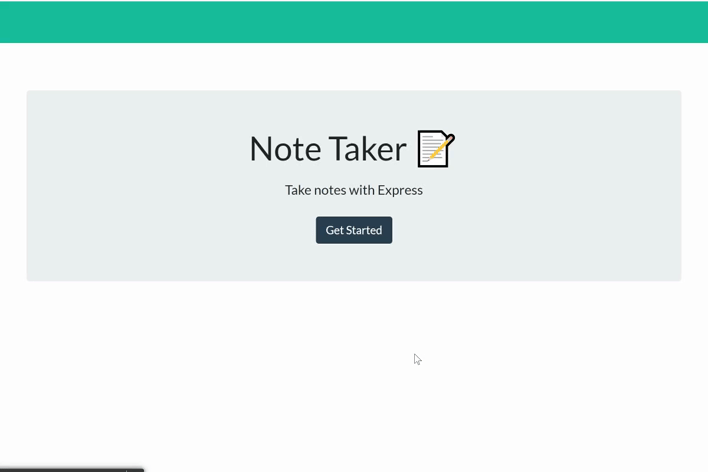

# Notes Taker
  

# Description

The Notes Take is an application that allows the user to write and save notes to organize thoughts and track tasks.

# Table of Contents  

  * [Usage](#usage)
  * [License](#license)
     
  # Usage
    
  Click on the button get started to be directed to your page of notes. Fill the form's fields for the Note Title and Note Text and then click on the save icon. Your saved note will appear at the left column of your page. If you want to save one more note, click on the "+"(plus icon) in the superior right corner. If you want to delete a note, click on the "trash can icon" near from your note.

# License
  

  Copyright (c) 2021 Virginia Rabello.
  Licensed under the [GPL-3.0](https://opensource.org/licenses/GPL-3.0) license.
  
# Questions
  
  If you have any questions about this app please email me at virginia.rabello2107@gmail.com.
